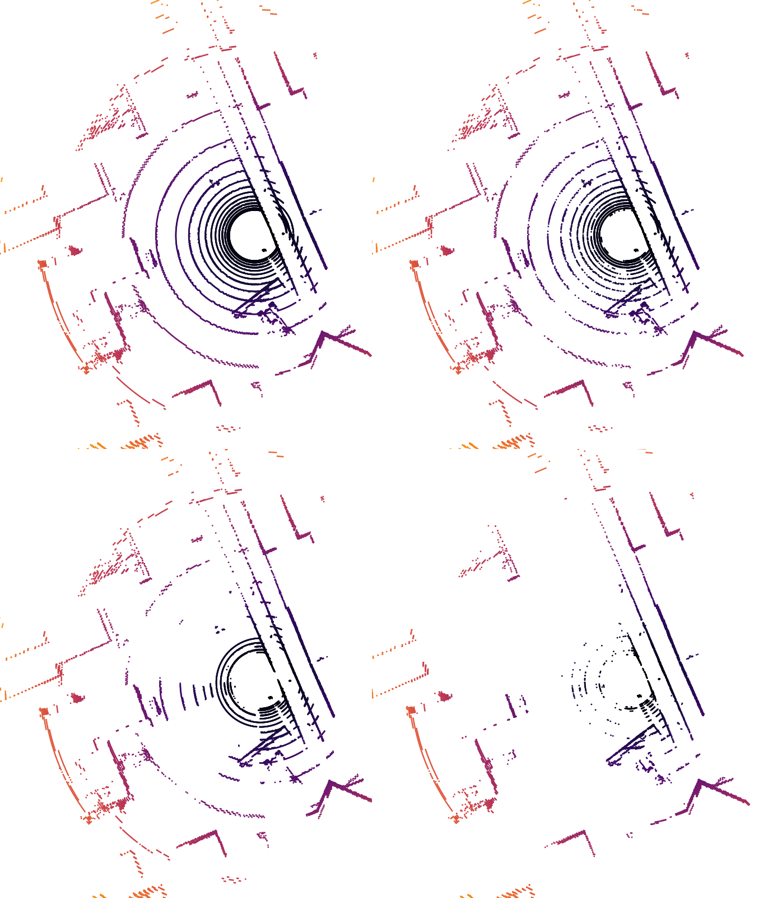
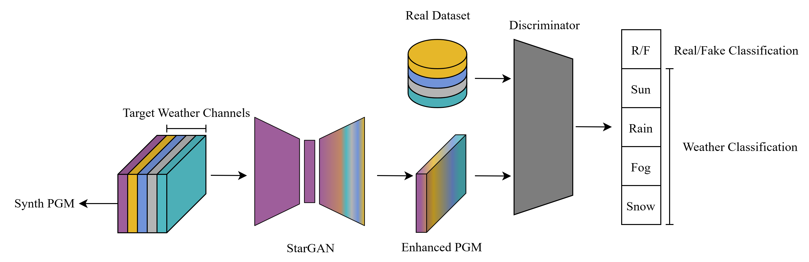

# RayGAN

> RayGAN is an unofficial name, let's call it RayGAN from now on

<p align="center"></p>

## Overview

Custom version of StarGAN (https://arxiv.org/abs/1711.09020) for performing realism enhancement of atmospheric dropout in point clouds.  
Training is done using real point clouds converted to polar grid maps. Neither intensity nor labels are required.

<p align="center"></p>

## Train Folder

```
project/
├─ example_dataset
└─ train.ipynb
```

- **example_dataset**: contains sample polar grid maps to be used during training (***.png*** resolution 32x1024)  
- **train.ipynb**: Jupyter Notebook for training

## Model Folder

Contains the pre-trained model.

## Enhance Folder

```text
enhance/
├─ enhance.py
├─ DatasetNotes.md
└─ visualize3Dpgm
```

- **enhance.py**: script used to apply the selected atmospheric noise to point clouds stored in `.bin` and `.label` format (KITTI format).

- **DatasetNotes.md**: due to the lack of standardization across point cloud datasets, the `enhance.py` file may need to be adapted depending on the dataset you want to enhance. This document contains the configuration details for the datasets used during training. If your dataset is not listed, you will need to identify the corresponding parameters and update `enhance.py` accordingly.

  The required modifications are straightforward:
  - Update `x_ind`, `y_ind`, and `z_ind` according to the positions of the x, y, and z coordinates within your point cloud format.
  - Adjust row/column ordering if necessary by modifying the indexing logic inside:
    ```python
    def get_x_y_z(self, i, points)
    ```
    For example, update expressions such as:
    ```python
    points[i][self.x_ind] <--> points[self.x_ind][i]
    ```
  - Configure the vertical LiDAR beam distribution according to your sensor. Depending on the LiDAR, the distribution may be linear or follow a specific pattern. See:
    ```python
    def get_nv(self, pitch)
    ```

- **visualize3Dpgm**: utility for visualizing the generated results.

## Results
Above, the synthetic point cloud. In the middle, the enhanced one. At the bottom, a real point cloud sharing the same dropout features.

##### SUN enhancement

Polar grid map at the bottom is from NuScenes dataset.


##### RAIN enhancement

Polar grid map at the bottom is from NuScenes dataset.


##### FOG enhancement

Polar grid map at the bottom is from SeeingThroughFog dataset.


##### SNOW enhancement

Polar grid map at the bottom is from cadcd dataset.


## License

This project is released under the MIT License.

```text
MIT License

Copyright (c) 2025 Jacopo Rizzi

Permission is hereby granted, free of charge, to any person obtaining a copy
of this software and associated documentation files (the "Software"), to deal
in the Software without restriction, including without limitation the rights
to use, copy, modify, merge, publish, distribute, sublicense, and/or sell
copies of the Software, and to permit persons to whom the Software is
furnished to do so, subject to the following conditions:

The above copyright notice and this permission notice shall be included in all
copies or substantial portions of the Software.

THE SOFTWARE IS PROVIDED "AS IS", WITHOUT WARRANTY OF ANY KIND, EXPRESS OR
IMPLIED, INCLUDING BUT NOT LIMITED TO THE WARRANTIES OF MERCHANTABILITY,
FITNESS FOR A PARTICULAR PURPOSE AND NONINFRINGEMENT. IN NO EVENT SHALL THE
AUTHORS OR COPYRIGHT HOLDERS BE LIABLE FOR ANY CLAIM, DAMAGES OR OTHER
LIABILITY, WHETHER IN AN ACTION OF CONTRACT, TORT OR OTHERWISE, ARISING FROM,
OUT OF OR IN CONNECTION WITH THE SOFTWARE OR THE USE OR OTHER DEALINGS IN THE
SOFTWARE.
```

See the `LICENSE` file for the full license text.

## Acknowledgments

This project was co-funded by the **University of Ferrara** and **Toyota Material Handling Manufacturing Italia**.

## Contact

For questions, suggestions, or collaborations, please open an issue in the repository or contact the project maintainer **jacopo.rizzi@unife.it**.
